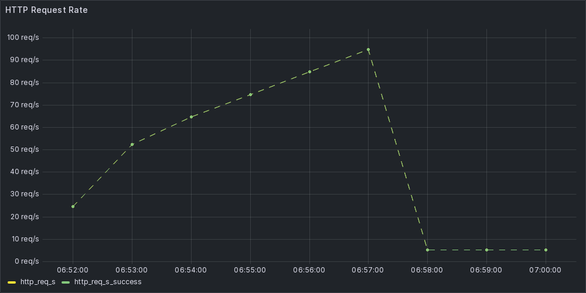
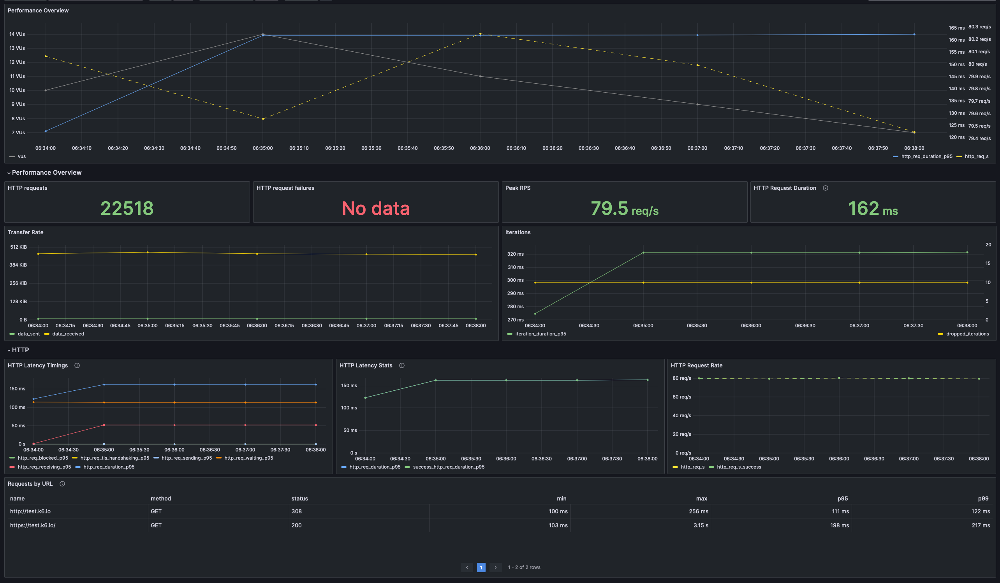

# Load Testing with k6

When developing a web application, ensuring it can handle anticipated traffic is crucial. Load testing, which involves
simulating expected traffic, allows you to observe how your application performs under such load.

There are numerous tools available to assist in this process, one of which is k6.

## What is k6?

k6 is a developer-centric, open-source load testing tool designed to test application or infrastructure performance by
simulating
traffic. Built using Go and JavaScript, it seamlessly integrates into your development workflow.

k6 tests generate metrics that can be exported to various systems, including Grafana, Datadog, and New Relic, enabling
you to monitor application and infrastructure performance.

Tests in k6 are scripted in JavaScript and can be executed via the command line. Additionally, k6 offers a cloud service
and Kubernetes integration, although we'll focus on the simplest method: running tests from the command line.

## Introduction to Tests

To conduct a basic test, you'll need to install the k6 tool and create a JavaScript file containing the test script.
Let's begin by installing k6 with the following command:

```bash
$ npm install -g k6
```

Then, create a JavaScript file with the following content:

```javascript
import http from 'k6/http';
import {sleep} from 'k6';

export default function () {
    http.get('http://test.k6.io');
    sleep(1);
}
```

### How to Run a Test

k6 offers three primary methods for test execution: via the command line, cloud, or Kubernetes. For now, we'll focus on
the command line.

```bash
$ k6 run my_test.js
```

#### Virtual Users (VUs) and Test Duration

By default, k6 runs the test once. However, you can specify the number of virtual users (VUs) and the test duration:

```bash
$ k6 run --vus 10 --duration 30s my_test.js
```

This command executes the test with 10 virtual users over a 30-second duration.

Upon test completion, the console displays the following result:

```

          /\      |‾‾| /‾‾/   /‾‾/
     /\  /  \     |  |/  /   /  /
    /  \/    \    |     (   /   ‾‾\
   /          \   |  |\  \ |  (‾)  |
  / __________ \  |__| \__\ \_____/ .io

  execution: local
     script: ./test-scripts/simple.js
     output: -

  scenarios: (100.00%) 1 scenario, 10 max VUs, 1m0s max duration (incl. graceful stop):
           * default: 10 looping VUs for 30s (gracefulStop: 30s)


     data_received..................: 2.7 MB 85 kB/s
     data_sent......................: 48 kB  1.5 kB/s
     http_req_blocked...............: avg=14.54ms  min=2µs      med=9µs      max=437.01ms p(90)=18µs     p(95)=37µs
     http_req_connecting............: avg=3.88ms   min=0s       med=0s       max=137.02ms p(90)=0s       p(95)=0s
     http_req_duration..............: avg=179.54ms min=121.16ms med=158.52ms max=1.37s    p(90)=247.84ms p(95)=257.19ms
       { expected_response:true }...: avg=179.54ms min=121.16ms med=158.52ms max=1.37s    p(90)=247.84ms p(95)=257.19ms
     http_req_failed................: 0.00%  ✓ 0         ✗ 442
     http_req_receiving.............: avg=6.27ms   min=30µs     med=134µs    max=162.53ms p(90)=360.5µs  p(95)=60.16ms
     http_req_sending...............: avg=40.25µs  min=10µs     med=35.5µs   max=310µs    p(90)=58µs     p(95)=71µs
     http_req_tls_handshaking.......: avg=8.71ms   min=0s       med=0s       max=401.03ms p(90)=0s       p(95)=0s
     http_req_waiting...............: avg=173.22ms min=120.89ms med=150.6ms  max=1.37s    p(90)=243.45ms p(95)=250.81ms
     http_reqs......................: 442    14.048303/s
     iteration_duration.............: avg=1.38s    min=1.27s    med=1.34s    max=2.51s    p(90)=1.4s     p(95)=1.47s
     iterations.....................: 221    7.024151/s
     vus............................: 4      min=4       max=10
     vus_max........................: 10     min=10      max=10


running (0m31.5s), 00/10 VUs, 221 complete and 0 interrupted iterations
default ✓ [======================================] 10 VUs  30s
```

k6 provides extensive metrics, including request duration, data sent and received, and more. This short summary gives us
first glimpse to the performance of our application.

#### Initialization Context and Default Function

It's recommended to configure test options within the test file itself rather than passing them as arguments
to `k6 run`. This can be done by defining an init context object:

```javascript
export const options = {
    vus: 10,
    duration: '30s',
};
```

Then, you can execute the test without specifying options:

```bash
$ k6 run my_test.js
```

For overriding specific options, refer to the documentation on option precedence.
https://grafana.com/docs/k6/latest/using-k6/k6-options/how-to/#order-of-precedence

##### Checks

Once the test generates some traffic, defining checks it se next step to evaluate service performance. Checks
verify expected response of you service, such as status codes, response headers and body content:

```javascript
import {check} from 'k6';
import http from 'k6/http';

export default function () {
    const res = http.get('http://test.k6.io/');
    check(res, {
        'is status 200': (r) => r.status === 200,
        'verify html content': (r) => r.body.includes('Collection of simple web-pages suitable for load testing'),
    });
}
```

```
     ✓ is status 200
     ✓ verify html content
```

Checks create rate metrics without failing the test if assertions are not met. We need to combine checks with thresholds
to fail the test on unmet assertion.

##### Thresholds

Thresholds allow setting performance criteria for tests, failing the test if criteria are not met. These criteria can be
defined for any generated default or custom metrics:

```javascript
export const options = {
    thresholds: {
        http_req_failed: ['rate<0.01'], // http errors should be less than 1%
        http_req_duration: ['p(95)<200'], // 95% of requests should be below 200ms
    },
};
```

Here we define two thresholds. The first one checks that the rate of failed requests is less than 1% by evaluating the
`http_req_failed` metric. The second one checks that 95% of requests are below 200ms.

You'll get a checkmark or a cross next to each threshold in the console output. And a error message if the threshold is
not met.

```
✗ http_req_duration..............: avg=214.99ms min=120.63ms med=178.85ms max=1.95s    p(90)=324.28ms p(95)=383.34ms
   { expected_response:true }...: avg=214.99ms min=120.63ms med=178.85ms max=1.95s    p(90)=324.28ms p(95)=383.34ms
✓ http_req_failed................: 0.00%   ✓ 0         ✗ 418
...
ERRO[0032] thresholds on metrics 'http_req_duration' have been crossed
```

### Scenarios

The current setup allows us to simulate basic traffic to our service, observe the application's behavior, and fail the
test if performance criteria are not met.

But what if we need to simulate more complex traffic patterns? This is where `scenarios` come into play.

Scenarios enable granular control over the behavior of virtual users (VUs). Multiple scenarios can be defined to manage
VUs' behavior and scheduling using scenario executors.

#### Scenario Executors

Executors determine the test duration, traffic distribution, and whether the test is driven by VUs or arrival rate.

We can choose one of predefined executors.

__By number of iterations.__

- `shared-iterations`: Shares iterations between VUs.
- `per-vu-iterations`: Each VU runs the configured iterations.

__By number of VUs.__

- `constant-VUs`: Sends VUs at a constant number.
- `ramping-vus`: Ramps the number of VUs according to configured stages.

__By iteration rate.__

- `constant-arrival-rate`: Starts iterations at a constant rate.
- `ramping-arrival-rate`: Ramps the iteration rate according to configured stages.

For simulating real-world traffic patterns, `ramping-arrival-rate` and `constant-arrival-rate` are typically most
suitable.

Each executor has its own options, such as `rate` for `constant-arrival-rate` or `stages` array
for `ramping-arrival-rate` executor, defining custom behavior for each.

Let's take this configuration as an example:

```javascript
export const options = {
    scenarios: {
        constant_load: {
            executor: 'ramping-arrival-rate',
            startRate: 0,
            timeUnit: '1s',
            preAllocatedVUs: 10,
            maxVUs: 50,
            stages: [
                {duration: '30s', target: 50},
                {duration: '1m30s', target: 100},
                {duration: '30s', target: 0},
            ],
        },
    },
};
```



In this example, we have a scenario named `constant_load` that uses the `ramping-arrival-rate` executor. It starts
with 0 iterations per second, ramps up to 50 over 30 seconds, increases further to 100 iterations per second over 1
minute and 30 seconds, then ramps down to 0 iterations per second over 30 seconds.

## Metrics

K6 gives us summary of the performance after each test as well as real-time metrics that can be exported to a file or
send directly to a consumer of you choice like prometheus.

Starting with metrics can be daunting, so it's best to first focus on a small subset and go from there.
We can start with the metrics that measure the requests (`http_reqs`), errors (`http_req_failed`), and
duration (`http_req_duration`).

#### End-of-Test Summary

After the test finishes, k6 displays a summary of results in the console. You can see http metrics define
avg, min, max, p90 and p95 values that gives us a more detail view of the performance.

```
    // ...

     http_req_blocked...............: avg=1.55ms   min=1µs      med=6µs      max=278.55ms p(90)=11µs     p(95)=14µs
     http_req_connecting............: avg=812.26µs min=0s       med=0s       max=138.46ms p(90)=0s       p(95)=0s
     http_req_duration..............: avg=111.18ms min=100.51ms med=108.18ms max=4.28s    p(90)=111.73ms p(95)=112.82ms
       { expected_response:true }...: avg=111.18ms min=100.51ms med=108.18ms max=4.28s    p(90)=111.73ms p(95)=112.82ms
     http_req_failed................: 0.00%  ✓ 0          ✗ 17966
     http_req_receiving.............: avg=277.31µs min=17µs     med=96µs     max=108.3ms  p(90)=219µs    p(95)=305.74µs
     http_req_sending...............: avg=28.84µs  min=5µs      med=25µs     max=3.8ms    p(90)=43µs     p(95)=53µs
     http_req_tls_handshaking.......: avg=722.35µs min=0s       med=0s       max=142.43ms p(90)=0s       p(95)=0s
     http_req_waiting...............: avg=110.88ms min=100.43ms med=108.02ms max=4.28s    p(90)=111.53ms p(95)=112.54ms
     http_reqs......................: 17966  119.773799/s
  
    // ...
```

#### Time Series Data

The summary is useful when you need a quick overview, but for more detailed analysis, we want to have real-time data
streamed directly into consumer like prometheus. We can do that with the `-out` option.

To set up remote write for prometheus we have to first define the prometheus server url in
the `K6_PROMETHEUS_RW_SERVER_URL` environment variable.

Then authenticate with `K6_PROMETHEUS_RW_USERNAME` and `K6_PROMETHEUS_RW_PASSWORD` if needed.

Finally run `k6 run -o experimental-prometheus-rw script.js`

Other export options include CSV, JSON, or streaming to alternative consumers like Datadog or Amazon CloudWatch.

A sample Grafana dashboard might display metrics as shown:



We have a nice graph showing all the information we need in time. We can see how the requests are distributed, how many
failed, and how long they took.

We can then analyze the data, compare them with other metrics we might have. Real time data gives us more granular view
of the performance and helps us understand how our application behaves in production environment.
With this information, we can make informed decisions about how to improve the performance of our application or
infrastructure.

## Conclusion

We've just scratched the surface of k6. We've seen how to run a simple test, how to define checks and thresholds, and
how to use scenarios to simulate complex traffic patterns.

We've also seen how to collect and analyze the metrics that k6 generates.

But there's much more to k6 than we've covered here. We can define custom metrics, use tags to group and filter tests,
and export metrics to various systems.

k6 is a powerful tool that can help you understand how your applications behave under load, and it's worth taking the
time to learn how to use it effectively.
