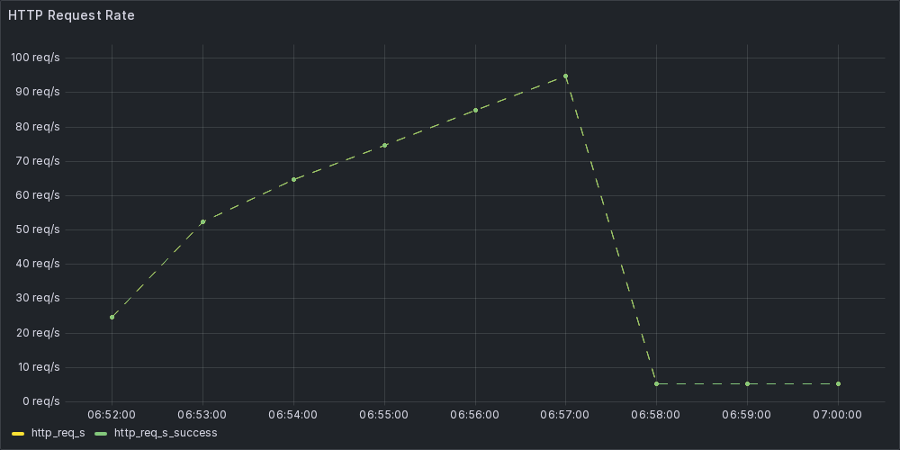
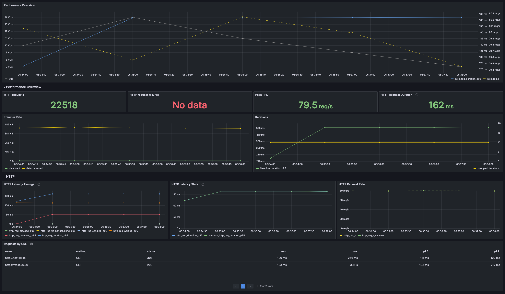

# Load testing with k6

- Intro to a problem
- What is k6
    - Load testing tool
    - Simulates traffic
    - Generates metrics
    - CLI, cloud, k8s
    - Scripting in JS
- Intro tests
    - How to run a test
        - CLI, cloud, k8s
        - vus and duration
        - The init context and default function
        - Tags
            - You can use tags to group and filter tests
            - There are user-defined tags and built-in tags (show table)
            - Unique URL creates unique tag and metrics. Use explicit name or http.url
    - Simple option
        - Show basic test
        - What are the basic options
            - Options precedence
            - Checks
            - Thresholds
                - Syntax
                - Aggregate method types
                - Abort on fail
                - Threshold examples to copy and paste
    - Multi-option variant
        - Show advanced example
        - What are the advanced options
- Metrics
    - What k6 gives me
        - End of test summary
        - Time series data
        - Standard built-in metrics
        - HTTP built-in metrics
    - How to extend them
    - Export to graphana?

## Intro to a problem

When you are developing a web application, you want to make sure that it can handle the expected traffic. You can do
this
by load testing your application. Simulating the expected traffic and seeing how your application behaves under that
load.

There are many tools that can help you with this. One of them is k6.

## What is k6

k6 is a developer-centric, open source load testing tool for testing the performance of your infrastructure by
simulating traffic.
It's built with Go and JavaScript to integrate well into your development workflow.

k6 tests generate metrics that can be exported to various systems, including Grafana, Datadog, and New Relic. These
metrics can be used to monitor the performance of your application and infrastructure.

k6 allows you to write tests in JavaScript and run them from the command line. It also provides a cloud service and a
kubernetes integration. We'll focus on the simplest use case - running tests from the command line.

## Intro tests

For running a simple test you'll need the k6 tool installed, and a javascript file with the test script.
Let's install k6 with this command:

```bash
$ npm install -g k6
```

And create a javascript file with the following content:

```javascript
import http from 'k6/http';
import {sleep} from 'k6';

export default function () {
    http.get('http://test.k6.io');
    sleep(1);
}
```

### How to run a test

k6 offers 3 main ways to run a test: from the command line, from the cloud, and as a kubernetes job. We'll stick with
the command line for now.

#### CLI, cloud, k8s

```bash
$ k6 run my_test.js
```

#### vus and duration

Without specifying any options, k6 will run the test once.
You can specify the number of virtual users and the duration of the test.

```bash
$ k6 run --vus 10 --duration 30s my_test.js
```

This command will run the test with 10 virtual users for 30 seconds. Now we're getting somewhere.

After the test finishes we'll see this result in the console:

```

          /\      |‾‾| /‾‾/   /‾‾/
     /\  /  \     |  |/  /   /  /
    /  \/    \    |     (   /   ‾‾\
   /          \   |  |\  \ |  (‾)  |
  / __________ \  |__| \__\ \_____/ .io

  execution: local
     script: ./test-scripts/simple.js
     output: -

  scenarios: (100.00%) 1 scenario, 10 max VUs, 1m0s max duration (incl. graceful stop):
           * default: 10 looping VUs for 30s (gracefulStop: 30s)


     data_received..................: 2.7 MB 85 kB/s
     data_sent......................: 48 kB  1.5 kB/s
     http_req_blocked...............: avg=14.54ms  min=2µs      med=9µs      max=437.01ms p(90)=18µs     p(95)=37µs
     http_req_connecting............: avg=3.88ms   min=0s       med=0s       max=137.02ms p(90)=0s       p(95)=0s
     http_req_duration..............: avg=179.54ms min=121.16ms med=158.52ms max=1.37s    p(90)=247.84ms p(95)=257.19ms
       { expected_response:true }...: avg=179.54ms min=121.16ms med=158.52ms max=1.37s    p(90)=247.84ms p(95)=257.19ms
     http_req_failed................: 0.00%  ✓ 0         ✗ 442
     http_req_receiving.............: avg=6.27ms   min=30µs     med=134µs    max=162.53ms p(90)=360.5µs  p(95)=60.16ms
     http_req_sending...............: avg=40.25µs  min=10µs     med=35.5µs   max=310µs    p(90)=58µs     p(95)=71µs
     http_req_tls_handshaking.......: avg=8.71ms   min=0s       med=0s       max=401.03ms p(90)=0s       p(95)=0s
     http_req_waiting...............: avg=173.22ms min=120.89ms med=150.6ms  max=1.37s    p(90)=243.45ms p(95)=250.81ms
     http_reqs......................: 442    14.048303/s
     iteration_duration.............: avg=1.38s    min=1.27s    med=1.34s    max=2.51s    p(90)=1.4s     p(95)=1.47s
     iterations.....................: 221    7.024151/s
     vus............................: 4      min=4       max=10
     vus_max........................: 10     min=10      max=10


running (0m31.5s), 00/10 VUs, 221 complete and 0 interrupted iterations
default ✓ [======================================] 10 VUs  30s
```

K6 generates a lot of useful metrics like request duration, data send and received, and more. We'll get to that later.

#### The init context and default function

Setting options as an argument to the `k6 run` command is not the best way to configure a test. You should write it as
an init context object in the file itself.

[//]: # (For a test file to be valid, it needs to have an init code, that configures the test, and a default functions including)

[//]: # (the)

[//]: # (test scenario. The init code is run once before the test starts, and the default function is run for each virtual user.)

```javascript
export const options = {
    vus: 10,
    duration: '30s',
};
```

Then you can run the test without any options:

```bash
$ k6 run my_test.js
```

Or if you need, take a look how k6 sets the priority of
options. https://grafana.com/docs/k6/latest/using-k6/k6-options/how-to/#order-of-precedence

[//]: # (#### Tags)

[//]: # (##### You can use tags to group and filter tests)

[//]: # (##### There are user-defined tags and built-in tags &#40;show table&#41;)

[//]: # (##### Unique URL creates unique tag and metrics. Use explicit name or http.url)

### Simple option

#### Show basic test

#### What are the basic options

[//]: # (##### Options precedence)

##### Checks

Now that we have a test hitting our service with hundreds of requests every second, we would like to define some checks
to evaluate the performance of our service.

Checks are a way to define the expected response of your service. You can define checks for values like the status code,
the response headers, and the content of the response body.

```javascript
import {check} from 'k6';
import http from 'k6/http';

export default function () {
    const res = http.get('http://test.k6.io/');
    check(res, {
        'is status 200': (r) => r.status === 200,
        'verify html content': (r) => r.body.includes('Collection of simple web-pages suitable for load testing'),
    });
}
```

```
     ✓ is status 200
     ✓ verify html content
```

Checks won't fail the test if the assertion is not met tho. They only create rate metrics on which you can set
thresholds.

##### Thresholds

Thresholds allow us to set performance criteria for our tests. We can set thresholds for any of the metrics that k6
generates or for custom metrics that we define.

When the threshold is not met, the test will fail.

```javascript
export const options = {
    thresholds: {
        http_req_failed: ['rate<0.01'], // http errors should be less than 1%
        http_req_duration: ['p(95)<200'], // 95% of requests should be below 200ms
    },
};
```

Here we define two thresholds. The first one checks that the rate of failed requests is less than 1% by evaluating the
`http_req_failed` metric. The second one checks that 95% of requests are below 200ms.

You'll get a checkmark or a cross next to each threshold in the console output. And a error message if the threshold is
not met.

```
✗ http_req_duration..............: avg=214.99ms min=120.63ms med=178.85ms max=1.95s    p(90)=324.28ms p(95)=383.34ms
   { expected_response:true }...: avg=214.99ms min=120.63ms med=178.85ms max=1.95s    p(90)=324.28ms p(95)=383.34ms
✓ http_req_failed................: 0.00%   ✓ 0         ✗ 418
...
ERRO[0032] thresholds on metrics 'http_req_duration' have been crossed
```

[//]: # (###### Syntax)

[//]: # (###### Aggregate method types)

[//]: # (###### Abort on fail)

[//]: # (###### Threshold examples to copy and paste)

### Scenarios

With the current setup we can simulate basic traffic to our service, observe the application's behavior, and fail the
test if the performance criteria are not met.

But what if we want to simulate more complex traffic patterns? Here comes the `scenarios`.

We use scenarios to control the behavior of the virtual users in a granular detail. We can define multiple scenarios and
control the VUs behaviour and scheduling with scenario executors.

#### Scenario executors

Executors determine the duration of the test, how the traffic is distributed, and whether the test is determined by the
VUs or the arrival rate.

We can pick one of predefined executors.
__By number of iterations.__

- `shared-iterations` shares iterations between VUs.
- `per-vu-iterations` has each VU run the configured iterations.

__By number of VUs.__

- `constant-VUs` sends VUs at a constant number.
- `ramping-vus` ramps the number of VUs according to your configured stages.

__By iteration rate.__

- `constant-arrival-rate` starts iterations at a constant rate.
- `ramping-arrival-rate` ramps the iteration rate according to your configured stages.

IMO, `ramping-arrival-rate` best represents the real-world traffic patterns.

Each executor has its own options, like `rate` for `constant-arrival-rate` executor. That defines custom behavior for
each executor.

Let's take this configuration as an example:

```javascript
export const options = {
    scenarios: {
        constant_load: {
            executor: 'ramping-arrival-rate',
            startRate: 0,
            timeUnit: '1s',
            preAllocatedVUs: 10,
            maxVUs: 50,
            stages: [
                {duration: '30s', target: 50},
                {duration: '1m30s', target: 100},
                {duration: '30s', target: 0},
            ],
        },
    },
};
```


We have a scenario called `constant_load` that uses the `ramping-arrival-rate` executor. It starts with 0 iterations
per second then tamps up to 50 over the 30 seconds. Then it continues to 100 iterations per second over 1 minute and 30
seconds. Then it ramps down to 0 iterations per second over 30 seconds.

#### Show advanced example

#### What are the advanced options

## Metrics

K6 gives us summary of the performance after each test as well as real time metrics that can be exported to a file or
send directly to a consumer of you choice like prometheus.

Starting with metrics can be daunting, so it's best to first focus on a small subset and go from there.
We can start with the metrics that measure the requests (`http_reqs`), errors (`http_req_failed`), and
duration (`http_req_duration`).

#### End of test summary

After the test finishes, k6 will print a summary of the test results to the console. You can see http metrics define
avg, min, max, p90 and p95 values that gives us a more detail view of the performance.

```
k6 run simple.js

          /\      |‾‾| /‾‾/   /‾‾/
     /\  /  \     |  |/  /   /  /
    /  \/    \    |     (   /   ‾‾\
   /          \   |  |\  \ |  (‾)  |
  / __________ \  |__| \__\ \_____/ .io

  execution: local
     script: simple.js
     output: -

  scenarios: (100.00%) 1 scenario, 50 max VUs, 3m0s max duration (incl. graceful stop):
           * constant_load: Up to 100.00 iterations/s for 2m30s over 3 stages (maxVUs: 10-50, gracefulStop: 30s)


     data_received..................: 107 MB 713 kB/s
     data_sent......................: 1.9 MB 12 kB/s
     dropped_iterations.............: 16     0.106667/s
     http_req_blocked...............: avg=1.55ms   min=1µs      med=6µs      max=278.55ms p(90)=11µs     p(95)=14µs
     http_req_connecting............: avg=812.26µs min=0s       med=0s       max=138.46ms p(90)=0s       p(95)=0s
     http_req_duration..............: avg=111.18ms min=100.51ms med=108.18ms max=4.28s    p(90)=111.73ms p(95)=112.82ms
       { expected_response:true }...: avg=111.18ms min=100.51ms med=108.18ms max=4.28s    p(90)=111.73ms p(95)=112.82ms
     http_req_failed................: 0.00%  ✓ 0          ✗ 17966
     http_req_receiving.............: avg=277.31µs min=17µs     med=96µs     max=108.3ms  p(90)=219µs    p(95)=305.74µs
     http_req_sending...............: avg=28.84µs  min=5µs      med=25µs     max=3.8ms    p(90)=43µs     p(95)=53µs
     http_req_tls_handshaking.......: avg=722.35µs min=0s       med=0s       max=142.43ms p(90)=0s       p(95)=0s
     http_req_waiting...............: avg=110.88ms min=100.43ms med=108.02ms max=4.28s    p(90)=111.53ms p(95)=112.54ms
     http_reqs......................: 17966  119.773799/s
     iteration_duration.............: avg=225.69ms min=205.71ms med=216.74ms max=4.67s    p(90)=220.88ms p(95)=223.72ms
     iterations.....................: 8983   59.886899/s
     vus............................: 0      min=0        max=24
     vus_max........................: 26     min=10       max=26


running (2m30.0s), 00/26 VUs, 8983 complete and 0 interrupted iterations
constant_load ✓ [======================================] 00/26 VUs  2m30s  001.29 iters/s
```

#### Time series data

The summary is useful when you need a quick overview, but for more detailed analysis, we want to have real-time data
streamed directly into consumer like prometheus. We can do that with the `-out` option.

Other options are of course available. We can export to csv or json file, or stream to different consumer like datadog,
Amazon CloudWatch, or TimescaleDB.

The result might then look like this in grafana dashboard:


We have a nice graph showing all the information we need in time. We can see how the requests are distributed, how many
failed, and how long they took.

We can then analyze the data, compare them with other metrics we might have and find bottlenecks in our application. 

[//]: # (#### Standard built-in metrics)

[//]: # (#### HTTP built-in metrics)

[//]: # (### How to extend them)

[//]: # (### Export to graphana?)

## Conclusion

We've just scratched the surface of k6. We've seen how to run a simple test, how to define checks and thresholds, and how
to use scenarios to simulate complex traffic patterns.

We've also seen how to collect and analyze the metrics that k6 generates.

But there's much more to k6 than we've covered here. We can define custom metrics, use tags to group and filter tests,
and export metrics to various systems.

k6 is a powerful tool that can help you understand how your applications behave under load, and it's worth taking the
time to learn how to use it effectively.
